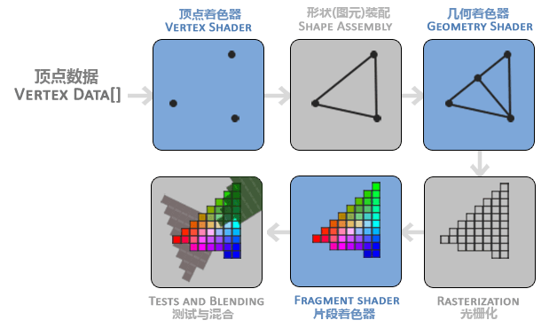

OpenGL 中，任何事物都是在 3D 空间中，而屏幕而是 2D 的，所以 OpenGL 的大部分工作是将 3D 坐标转换为 2D 的过程。这个处理过程由 OpenGL 的 **图形渲染管线**（Graphics Pipeline）进行管理。

**图形渲染管线分为两部分：**

1. 把 3D 坐标转换为 2D 坐标
2. 把 2D 坐标转换为实际的有颜色的像素

> 双缓冲 (Double Buffer)
>
> 应用程序使用单缓冲绘图时可能会存在图像闪烁的问题。这是因为生成的图像不是一下子被绘制出来，而是从左到右，从上到下逐像素绘制而成。最终图像不是在瞬间显示给用户，而是通过一步步生成的，这会导致显然的结果很不真实。为了规避这些问题，可以使用双缓冲来渲染窗口应用程序。**前** 缓冲保存着最终输出的图像，它会在屏幕上显示；而所有的渲染指令都会保存在 **后** 缓冲上绘制。当所有的渲染指令执行完毕后，**交换** 前后缓冲，这样图片就立即显示出来了，之前的不真实感就消除了。

当今大多数显卡都有成千上万的小处理核心，它们在GPU上为每一个（渲染管线）阶段运行各自的小程序，从而在图形渲染管线中快速处理你的数据。这些小程序叫做 **着色器**(Shader)。OpenGL 着色器使用 OpenGL **着色器语言**（OpenGL Shading Language, GLSL）写成的。

图形渲染管线示意图：



图形渲染管线的过程是复杂的，通常我们只需要配置 **顶点** 和 **片段着色器** 即可。几何着色器是可选的，通常我们使用默认的即可。

## 一些示例代码

- 初始配置 GLFW 窗口

  ```C++
  int main() {
    glfwInit();
    glfwWindowHint(GLFW_CONTEXT_VERSION_MAJOR, 3); // 主版本号
    glfwWindowHint(GLFW_CONTEXT_VERSION_MINOR, 3); // 次版本号
    glfwWindowHint(GLFW_OPENGL_PROFILE, GLFW_OPENGL_CORE_PROFILE); // 设置 OpenGL 的模式（核心模式 / 立即渲染模式）
    // glfwWindowHint(GLFW_OPENGL_FORWARD_COMPAT, GL_TRUE); // Mac 系统需要添加这一行代码

    return 0;
  }
  ```

- 初始化 GLAD

  ```C++
  if (!gladLoadGLLoder((GLADloadproc)glfwGetProcAddress)) {
    cout << "Filed to init glad" << endl;
    return -1;
  }
  ```

- 窗口大小改变时调整视口大小

  ```C++
  void frameBuffer_size_callback(GLFWwindow* window, int width, int height) {
    glViewport(0, 0, width, height);
  }

  glfwSetFramebufferSizeCallback(window, frameBuffer_size_callback);
  ```

- 响应按键操作

  ```C++
  void processInput() {
    if (glfwGetKey(window, GLFW_KEY_ESCAPE) == GLFW_PRESS) { // 按下 Esc，关闭窗口
      glfwSetWindowShouldClose(window, true);
    }
  }
  ```

- 将渲染操作放入渲染循环中

  ```C++
  while (!glfwWindowShouldClose(window)) {
    // 按键操作
    processInput(window);

    // 渲染指令
    // ...

    // 轮询是否有事件需要调用，交换缓冲
    glfwPollEvents();
    glfwSwapBuffers(window);
  }
  ```

## OpenGL API

- `glClear(buffer)`

  用来清空缓冲，清空的缓冲类型由参数指定。
  参数是一个缓冲位，取值有：`GL_COLOR_BUFFER_BIT`, `GL_DEPTH_BUFFER_BIT`, `GL_STENCIL_BUFFER_BIT`

- `glClearColor(r, g, b, a)`

  设置清空屏幕所用的颜色。
  参数是一个颜色的 RGBA 值

- `glViewport(posX, posY, width, height)`

  设置视口的维度（Dimension）

## GLFW API

- `glfwInit()`

  实例化 GLFW 窗口。

- `glfwWindowHint(GLFW_*, num)`

  配置 GLFW 窗口。
  第一个参数代表选项名称。这个选项名称可以从很多 `GLFW_` 开头的枚举值中选择。第二个参数是这个选项的值。

  > 第一个参数对应的所有选项都可以在这找到：[GLFW’s window handling](https://www.glfw.org/docs/latest/window.html#window_hints)

- `glfwCreateWindow(width, height, name, NULL, NULL)`

  创建一个 GLFW 窗口，并返回一个 GLFWwindow 对象。

  由于这个函数返回的 GLFWwindow 对象，在后面会经常用到，所以可以这样保存起来：

  ```C++
  // 最后两个参数暂时先设为 NULL
  GLFWwindow* window = glfwWindow(800, 600, "liuyibo", NULL, NULL);
  ```

- `glfwMakeContextCurrent(GLFWwindow* window)`

  使指定的窗口的上下文在调用线程上最新。

- `glfwSetFramebufferSizeCallback(GLFWwindow* window, callback)`

  监听指定的窗口，当期大小改变时，执行回调函数。

- `glfwWindowShouldClose(GLFWwindow* window)`

  返回指定窗口的关闭标志的值

- `glfwSwapBuffers(GLFWwindow* window)`

  用于交换指定窗口的前缓冲区和后缓冲区。（指定的窗口必须具有 OpenGL 或 OpenGL ES 上下文，否则会抛错）

- `glfwPollEvents()`

  检测是否有事件触发，即执行事件队列中的事件，然后立即返回。（执行事件意味着会调用与事件相关的窗口和回调函数）`Poll: 轮询`

- `glfwTerminate()`

  释放之前分配的所有资源。

- `glfwGetKey(GLFWwindow* window, key)`

  返回指定按键的最后的状态。返回的状态有：`GLFW_PRESS` 或 `GLFW_RELEASE`。
  全部键的取值：[Keyboard keys](https://www.glfw.org/docs/latest/group__keys.html)

  > 不要用此方法实现文本输入功能

- `glfwSetWindowShouldClose(GLFWwindow* window, value)`

  设置指定窗口关闭标志的值。（value 为 true，直接关闭窗口）
